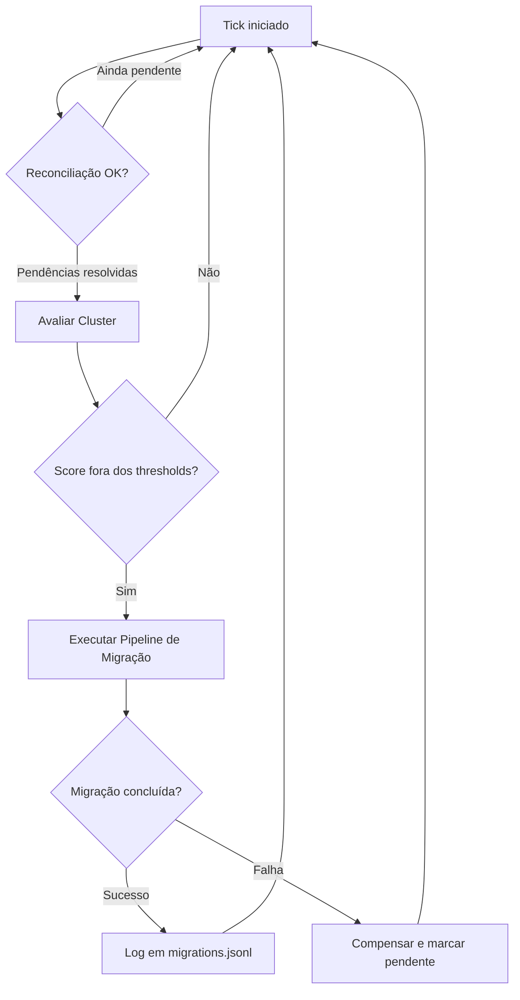

# Overview — O que é o CANM

## Propósito

**CANM** (*Cost Aware Node Migration*) é um sistema autônomo de otimização de custos em clusters Kubernetes no Google Kubernetes Engine (GKE). Ele observa continuamente o uso de recursos dos nós e, quando detecta subutilização ou sobrecarga, executa migrações automáticas entre node pools de diferentes custos/capacidades.

---

## Problema que Resolve

Clusters Kubernetes frequentemente têm workloads dinâmicos: períodos de alta demanda alternam com períodos de baixo uso. O mecanismo é capaz de detectar nós com baixa utilização de recursos e migrar para tier mais econômicos, o inverso também se aplica. 

---

## O que o CANM Faz

```
Situação detectada               Ação tomada
──────────────────────────────────────────────────────────────
Nó no high pool com score baixo → Move para o low pool (economiza)
Nó no low pool com score alto   → Move para o high pool (garante performance)
```

O sistema cria o nó destino, drena os pods do nó origem (que são reagendados automaticamente pelo scheduler do Kubernetes), e então remove o nó origem. Se o cluster do Kubernetes for bem configurado com redundância de Pods e políticas de PDB, a migração ocorre sem impactar negativamente métricas de qualidade de serviço como indisponibilidade.

---

## Cenário Típico de Uso

```
┌─────────────────────────────────────────────────┐
│  Cluster GKE — us-central1-a                    │
│  Y = 0.35                                       │
│  HIGH POOL                                      │
│  ├── node-A  score: 0.72 (ativo, não migrar)    │
│  ├── node-B  score: 0.18 ← subutilizado!        │
│  └── node-C  score: 0.41 (ok, acima de Y)       │
│                                                 │
│  LOW POOL                                       │
│  ├── node-D  score: 0.45 (normal)               │
│  └── node-E  score: 0.63 ← sobrecarregado!      │
└─────────────────────────────────────────────────┘

CANM detecta node-B (high pool, score 0.18 ≤ Y):
  → Inicia migração high→low
  → Cria gke-canm-pool-beta-a3f7... no low pool
  → Drena pods de node-B
  → Remove node-B da MIG do high pool
  → Economiza custo de 1 nó high-performance
```

---

## Fluxo Macro



---

## Posição no Ecossistema

O CANM é um **operador leve** fora do cluster (não é um controller K8s nativo, não tem CRDs), que:

- Lê métricas do **Prometheus** (externo ao cluster)
- Usa o **SDK Kubernetes** para ler/anotar nós
- Usa o **gcloud CLI** para criar/remover instâncias nas MIGs do GKE
- Usa o **kubectl** para drenar pods dos nós

---

## Relacionados

- [[02 - Architecture]] — como os componentes se encaixam internamente
- [[03 - Scoring and Decision]] — como o score é calculado e a decisão é tomada
- [[06 - Configuration]] — como configurar o CANM para o seu cluster
